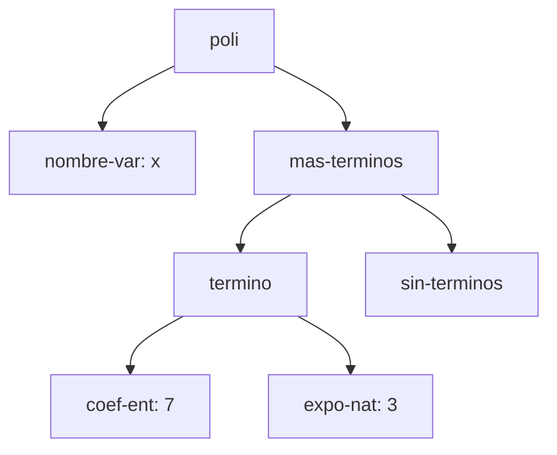
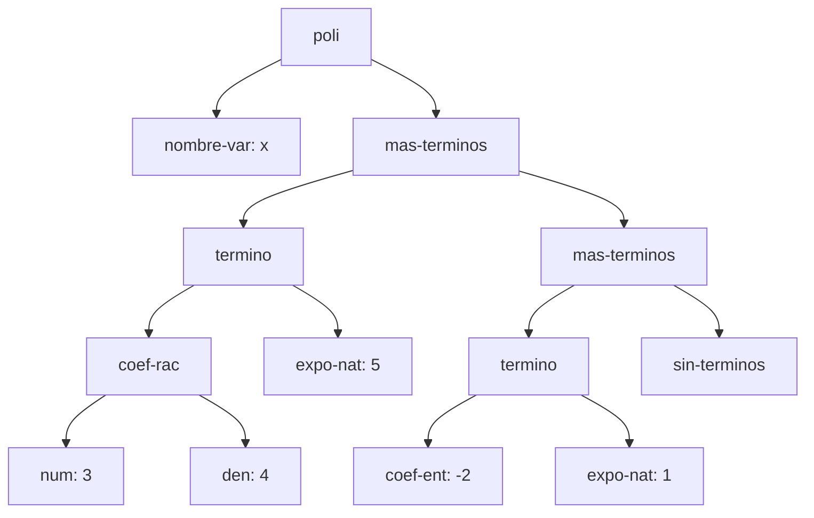
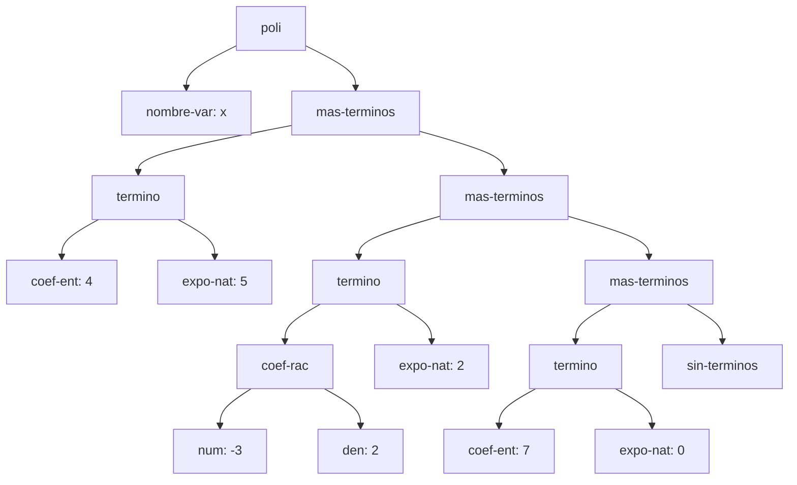
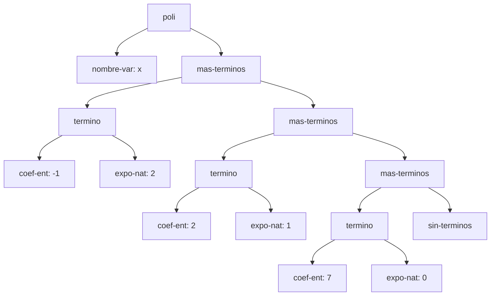

# Informe de AST — Taller 1: polinomios dispersos

**Curso:** Fundamentos de Interpretación y Compilación de Lenguajes
de Programación — Universidad del Valle, Sede Tuluá.

**Integrantes del grupo:**

| Nombre | Código | Correo institucional |
|--------|--------|----------------------|
| Juan Felipe Aristizabal | 2459364-3743 | juan.felipe.aristizabal@correounivalle.edu.co |
| Juan Sebastian Huertas | 2459505-3743 | huertas.juan@correounivalle.edu.co |

---

## 1. Gramática considerada

Esta es la gramática del enunciado. Los nombres del recuadro son los
constructores que deben aparecer como etiquetas en los diagramas de la
sección 2.

```bnf
<polinomio>   ::= <variable> <terminos>
                   poli(var, terms)

<variable>    ::= <symbol>
                   nombre-var(s)

<terminos>    ::= '()
                   sin-terminos()
              ::= <termino> <terminos>
                   mas-terminos(term, resto)

<termino>     ::= <coeficiente> <exponente>
                   termino(coef, expo)

<coeficiente> ::= <int>
                   coef-ent(n)
              ::= <int> "/" <int>
                   coef-rac(num, den)

<exponente>   ::= <int>
                   expo-nat(k)
```

Indique cómo se realiza cada no terminal en su implementación con
`define-datatype`:

| No terminal | Variantes del datatype | Campos |
|---|---|---|
| `<polinomio>` | `poli` | `var` (`variable`), `terms` (`terminos`) |
| `<variable>` | `nombre-var` | `s` (`symbol`) |
| `<terminos>` | `sin-terminos`, `mas-terminos` | `sin-terminos`: ninguno; `mas-terminos`: `term` (`termino-tad`), `resto` (`terminos`) |
| `<termino>` | `termino` (tipo `termino-tad`) | `coef` (`coeficiente`), `expo` (`exponente`) |
| `<coeficiente>` | `coef-ent`, `coef-rac` | `coef-ent`: `n` (entero); `coef-rac`: `num`, `den` (enteros) |
| `<exponente>` | `expo-nat` | `k` (entero) |

---

## 2. Ejemplos de AST

> Los cuatro ejemplos que siguen son los que pide el enunciado. Cada
> uno lleva el polinomio escrito en notación matemática, el AST como
> diagrama Mermaid con los nombres de los constructores en los nodos,
> y una explicación breve.
>
> El nodo del final de la lista de términos, `sin-terminos`, se dibuja
> siempre: es el caso base de la recursión y sin él el árbol queda
> incompleto.

### Ejemplo 1 — un solo término con coeficiente entero

**Polinomio:** $p_1 = 7x^{3}$

**Construcción:**

```scheme
(poli (nombre-var 'x)
      (mas-terminos (termino (coef-ent 7) (expo-nat 3))
                    (sin-terminos)))
```

**AST:**



**Explicación:** la variable del polinomio es el hijo `nombre-var: x`
de la raíz `poli`; el otro hijo es la lista de términos. Esa lista es
un `mas-terminos` cuyo primer campo es el único término, $7x^3$, y
cuyo resto es `sin-terminos`, que cierra la lista. El coeficiente
(`coef-ent: 7`) y el exponente (`expo-nat: 3`) son nodos separados
porque son partes distintas de la gramática (`<coeficiente>` y
`<exponente>`) y cada una puede tener variantes propias: el
coeficiente puede ser entero o racional, mientras que el exponente
siempre es un natural.

---

### Ejemplo 2 — dos términos, uno con coeficiente racional

**Polinomio:** $p_2 = \frac{3}{4}x^{5} - 2x$

**Construcción:**

```scheme
(poli (nombre-var 'x)
      (mas-terminos (termino (coef-rac 3 4) (expo-nat 5))
        (mas-terminos (termino (coef-ent -2) (expo-nat 1))
          (sin-terminos))))
```

**AST:**



**Explicación:** el subárbol de `coef-rac` tiene dos hijos, el
numerador (`num: 3`) y el denominador (`den: 4`), mientras que
`coef-ent` tiene uno solo, el entero (`n`). El orden decreciente de
exponentes que exige el invariante se ve al leer la lista de términos
de arriba hacia abajo: el primer `mas-terminos` guarda el término de
exponente 5, y el `mas-terminos` anidado en su resto guarda el de
exponente 1, que es menor. Cada nivel más profundo del árbol tiene un
exponente estrictamente menor.

---

### Ejemplo 3 — tres o más términos, con término independiente

**Polinomio:** $p_3 = 4x^{5} - \frac{3}{2}x^{2} + 7$

**Construcción:**

```scheme
(poli (nombre-var 'x)
      (mas-terminos (termino (coef-ent 4) (expo-nat 5))
        (mas-terminos (termino (coef-rac -3 2) (expo-nat 2))
          (mas-terminos (termino (coef-ent 7) (expo-nat 0))
            (sin-terminos)))))
```

**AST:**



**Explicación:** el término independiente $7$ se representa como un
`termino` más, con `coef-ent: 7` y exponente `expo-nat: 0`, porque
$7 = 7x^0$. Su exponente sigue siendo un nodo `expo-nat` porque la
gramática no tiene un caso especial para constantes: todo término
tiene coeficiente y exponente, y así las operaciones (como el orden
decreciente y la suma) tratan a todos los términos igual. Aquí
también se ve que el signo negativo del racional $-\frac{3}{2}$ va en
el numerador (`num: -3`) y el denominador es positivo.

---

### Ejemplo 4 — el resultado de `(sumar p q)`

Use los polinomios $p$ y $q$ del ejemplo de la Parte 3 del enunciado.

**Operandos:**

- $p = 4x^{5} - \frac{3}{2}x^{2} + 7$
- $q = -4x^{5} + \frac{1}{2}x^{2} + 2x$

**Resultado:** $p + q = -x^{2} + 2x + 7$

**AST del resultado:**



**Origen de cada nodo.** Complete la tabla: por cada término del
resultado, de cuál operando salió, y aparte los términos que se
cancelaron y por eso no aparecen en el árbol.

| Término del resultado | Viene de | Observación |
|---|---|---|
| $-1 \cdot x^{2}$ (`coef-ent: -1`, `expo-nat: 2`) | suma de ambos | $-\frac{3}{2} + \frac{1}{2} = -1$; el resultado es entero, por eso se guarda como `coef-ent` y no como `coef-rac`. |
| $2 \cdot x^{1}$ (`coef-ent: 2`, `expo-nat: 1`) | $q$ | $p$ no tiene término de exponente 1, así que el término de $q$ pasa sin cambios. |
| $7 \cdot x^{0}$ (`coef-ent: 7`, `expo-nat: 0`) | $p$ | $q$ no tiene término independiente, así que el de $p$ pasa sin cambios. |

**Términos cancelados:** el término de $x^{5}$ se anuló, porque
$4 + (-4) = 0$. El invariante exige que no haya coeficientes iguales
a cero en la lista, así que ese término no se agrega al resultado:
la suma sigue con el resto de ambas listas y por eso no aparece
ningún nodo `termino` con exponente 5 en el árbol. Sin esta regla, el
árbol tendría un nodo `coef-ent: 0` que rompe la segunda condición
del invariante (sin ceros).

---

## 3. Referencias

- Friedman, D. P., & Wand, M. *Essentials of Programming Languages*,
  3.ª ed., MIT Press, 2008. Sección 2.1 (especificación de datos),
  sección 2.2 (representaciones de un TAD), sección 2.4
  (`define-datatype` y `cases`).
- Documentación de Racket: lenguaje `eopl` y biblioteca `rackunit`,
  https://docs.racket-lang.org/
- Enunciado del Taller 1 de FLP 2026-2, Universidad del Valle, Sede Tuluá.