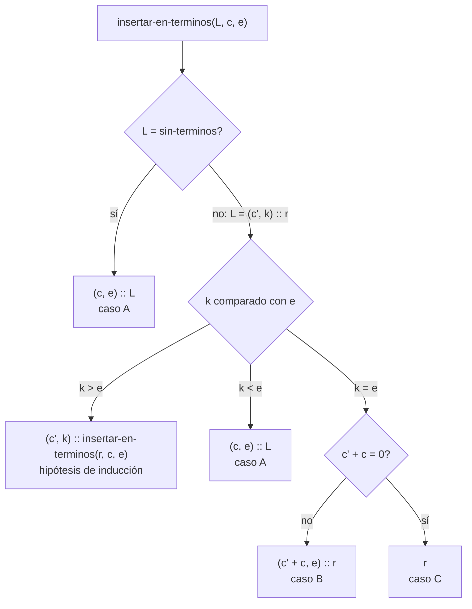
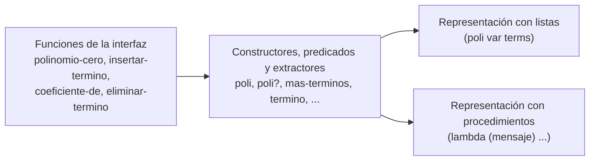

# Informe de corrección — Taller 1: polinomios dispersos

**Curso:** Fundamentos de Interpretación y Compilación de Lenguajes
de Programación — Universidad del Valle, Sede Tuluá.

**Integrantes del grupo:**

| Nombre | Código | Correo institucional |
|--------|--------|----------------------|
| Juan Felipe Aristizabal | 2459364-3743 | juan.felipe.aristizabal@correounivalle.edu.co |
| Juan Sebastian Huertas | 2459505-3743 | huertas.juan@correounivalle.edu.co |

---

## 1. Marco formal

### 1.1 Corrección de programas recursivos

Sea $f : A \to B$ una función y $A$ un conjunto definido
recursivamente. Sea $P_f$ un programa recursivo en Racket que pretende
calcular $f$. Decimos que $P_f$ es correcto con respecto a su
especificación si se cumple:

$$
\forall a \in A \,:\, P_f(a) = f(a)
$$

La estrategia de demostración es **inducción estructural** sobre $A$.
Aquí $A$ es el conjunto de listas de términos que genera la gramática:

- **Caso base:** $a = \text{sin-terminos}()$, y se verifica
  $P_f(a) = f(a)$ directamente.
- **Caso inductivo:** $a = \text{mas-terminos}(t, r)$. Se asume la
  **hipótesis de inducción** $P_f(r) = f(r)$ sobre el resto de la
  lista y se demuestra $P_f(a) = f(a)$.

Si alguna de sus funciones quedó escrita con un acumulador en lugar de
recursión estructural, la corrección se argumenta con una invariante
del acumulador y no con la hipótesis de inducción: enuncie la
invariante, demuestre que vale al inicio, que cada paso la conserva y
que al terminar implica la post-condición.

### 1.2 El invariante de la representación

Las cuatro condiciones del enunciado se enuncian como una única
propiedad sobre polinomios. Sea $p$ un polinomio con términos
$t_1, t_2, \ldots, t_n$, donde $t_i = (c_i, e_i)$:

$$
\mathrm{Inv}(p) \equiv
\underbrace{\forall i < n : e_i > e_{i+1}}_{\text{orden estricto}}
\ \land\
\underbrace{\forall i : c_i \neq 0}_{\text{sin ceros}}
\ \land\
\underbrace{\forall i : e_i \in \mathbb{N}}_{\text{exponentes naturales}}
\ \land\
\underbrace{\forall i : \mathrm{red}(c_i)}_{\text{racionales reducidos}}
$$

donde $\mathrm{red}\left(\frac{a}{b}\right)$ abrevia
$b > 0 \,\land\, \mathrm{mcd}(|a|, b) = 1$, y un coeficiente entero se
toma como el racional de denominador $1$.

En el código, la cuarta condición la garantiza la traducción de
números de Racket a coeficientes (`concreto->coeficiente`): un entero
se guarda como `coef-ent` (denominador $1$) y una fracción como
`coef-rac` con `numerator` y `denominator`, que en Racket siempre
devuelven el numerador y el denominador de la fracción **ya reducida**
y con denominador positivo. Las demás tres condiciones se verifican
caso por caso en las secciones siguientes.

Para hablar de lo que "dice" un polinomio sin mirar su forma, se usa la
función $f_p : \mathbb{N} \to \mathbb{Q}$ que da el coeficiente de
$x^e$ en $p$, o $0$ si $p$ no tiene término con ese exponente. Con
$\mathrm{Inv}(p)$ cada exponente aparece a lo sumo una vez, así que
$f_p$ está bien definida.

---

## 2. Funciones analizadas

### 2.1 Corrección de `coeficiente-de`

**Especificación.**

- **Tipo:** `coeficiente-de : polinomio × exponente -> coeficiente`
- **Pre-condición:** $\mathrm{Inv}(p)$ y {{condición sobre el
  exponente consultado}}.
- **Post-condición:** $\text{Post}(p, e, r) \equiv {{\ldots}}$ cuando
  el exponente $e$ aparece en $p$; y la función levanta
  `eopl:error` cuando no aparece.

**Código.**

```racket
; coeficiente-de : {{contrato}}
; Propósito: {{...}}
(define (coeficiente-de p e)
  ...)
```

**Demostración.**

- **Caso base** ($\text{sin-terminos}$): {{qué hace el programa y por
  qué eso es exactamente levantar el error.}}

  $$
  {{\ldots}}
  $$

- **Caso inductivo** ($\text{mas-terminos}(t, r)$): distinga los tres
  subcasos según la comparación entre el exponente de $t$ y el
  exponente buscado. {{Uno de ellos usa la hipótesis de inducción
  sobre $r$; explique por qué el orden estricto del invariante permite
  cortar la búsqueda sin recorrer el resto de la lista.}}

  $$
  {{\ldots}}
  $$

- **Levantamiento del error.** Demuestre que el error se levanta
  cuando el exponente no está y **solo** en ese caso.

- **Terminación.** {{Medida que decrece estrictamente en cada llamada
  y cota inferior.}}

**Conclusión:** {{...}}

---

### 2.2 Corrección de `eliminar-termino`

**Especificación.**

- **Tipo:** `eliminar-termino : polinomio × exponente -> polinomio`
- **Pre-condición:** $\mathrm{Inv}(p)$ y {{...}}.
- **Post-condición:** el resultado contiene **exactamente** los
  términos de $p$ menos el de exponente $e$. Formalmente:
  $$
  \text{terminos}(r) = \text{terminos}(p) \setminus \{{\ldots}\}
  $$
  y la función levanta `eopl:error` si $e$ no aparece en $p$.

**Código.**

```racket
(define (eliminar-termino p e)
  ...)
```

**Demostración.** Siga el esquema de 2.1: caso base, caso inductivo
con hipótesis de inducción, error y terminación. {{Además de la
igualdad de conjuntos de términos, argumente que el resultado sigue
cumpliendo $\mathrm{Inv}$: quitar un término no rompe el orden
estricto ni introduce ceros.}}

---

### 2.3 `insertar-termino` preserva el invariante

**Enunciado.** Si $\mathrm{Inv}(p)$ vale antes de la llamada, entonces
$\mathrm{Inv}(\texttt{insertar-termino}(p, c, e))$ vale sobre el
resultado.

**Especificación.**

- **Tipo:** `insertar-termino : polinomio × número × natural -> polinomio`
- **Pre-condición:** $\mathrm{Inv}(p)$, $c \in \mathbb{Q}$ exacto y
  $e \in \mathbb{N}$. Si $e$ no es un entero no negativo, si $c$ no es
  un número exacto o si $p$ no es un polinomio, la función levanta
  `eopl:error` antes de construir nada.
- **Post-condición:** el resultado $r$ tiene la misma variable que $p$,
  cumple $\mathrm{Inv}(r)$ y

  $$
  f_r(x) =
  \begin{cases}
    f_p(e) + c & \text{si } x = e \\
    f_p(x)     & \text{si } x \neq e
  \end{cases}
  $$

**Código.**

```racket
; insertar-en-terminos : terminos x numero x natural -> terminos
; Recorre la lista una sola vez. Si el exponente actual es mayor, sigue con el
; resto; si es menor, el término nuevo va antes; si es igual, suma los
; coeficientes (si da 0 quita el término).
(define insertar-en-terminos
  (lambda (terminos coeficiente exponente)
    (if (sin-terminos? terminos)
        (mas-terminos (crear-termino coeficiente exponente) terminos)
        (let* ((actual (mas-terminos->term terminos))
               (resto  (mas-terminos->resto terminos))
               (expo   (expo-nat->k (termino->expo actual))))
          (cond
            ((> expo exponente)
             (mas-terminos actual (insertar-en-terminos resto coeficiente exponente)))
            ((< expo exponente)
             (mas-terminos (crear-termino coeficiente exponente) terminos))
            (else
             (let ((suma (+ (coeficiente->concreto (termino->coef actual)) coeficiente)))
               (if (zero? suma)
                   resto
                   (mas-terminos (crear-termino suma exponente) resto)))))))))

; insertar-termino : polinomio x numero x natural -> polinomio
; Inserta el término en su lugar. Si el exponente ya está, suma los
; coeficientes (si da 0 quita el término). Con coeficiente 0 no cambia nada.
(define insertar-termino
  (lambda (polinomio coeficiente exponente)
    (cond
      ((not (exponente-concreto? exponente))
       (eopl:error 'insertar-termino "El exponente debe ser un entero no negativo"))
      ((not (coeficiente-concreto? coeficiente))
       (eopl:error 'insertar-termino "El coeficiente debe ser un numero exacto"))
      ((not (poli? polinomio))
       (eopl:error 'insertar-termino "El primer argumento debe ser un polinomio"))
      ((zero? coeficiente)
       polinomio)
      (else
       (poli (poli->var polinomio)
             (insertar-en-terminos (poli->terms polinomio) coeficiente exponente))))))
```

La recursión vive en `insertar-en-terminos`. El siguiente diagrama
resume sus ramas; cada una se justifica abajo.



**Paso 0: validaciones y coeficiente cero.** Si alguna validación
falla se levanta el error y no se construye ningún polinomio, así que
no hay nada que verificar. Si $c = 0$ la función devuelve $p$ sin
tocarlo: $\mathrm{Inv}(r) = \mathrm{Inv}(p)$ y $f_r = f_p = f_p + 0$.
Este caso se saca antes de la recursión por una razón concreta: si se
insertara un término $(0, e)$ se rompería la segunda condición del
invariante (sin ceros). Desde aquí $c \neq 0$ y la función solo arma
`poli(var, insertar-en-terminos(L, c, e))`, con la misma variable, así
que basta demostrar el lema siguiente sobre la lista $L$ de términos
de $p$.

**Observación sobre coeficientes reducidos.** Todo término nuevo se
arma con `crear-termino`, que traduce el número de Racket con
`concreto->coeficiente`. Un entero queda como `coef-ent`; una fracción
queda como `coef-rac` con `numerator` y `denominator`, y estos
devuelven la fracción reducida con denominador positivo. Por eso todo
término creado cumple la cuarta condición, y cumple la tercera porque
su exponente es el $e \in \mathbb{N}$ de la pre-condición. Además, la
suma de dos racionales exactos es un racional exacto, así que la
observación también vale para $c' + c$.

**Lema.** Sea $L$ una lista de términos con $\mathrm{Inv}(L)$, sea
$c \in \mathbb{Q} \setminus \{0\}$ y $e \in \mathbb{N}$. Entonces
$R = \texttt{insertar-en-terminos}(L, c, e)$ cumple $\mathrm{Inv}(R)$ y
$f_R(e) = f_L(e) + c$, $f_R(x) = f_L(x)$ para $x \neq e$.

**Demostración** por inducción estructural sobre $L$.

- **Caso A, base: $L = \text{sin-terminos}()$.** El resultado es
  $R = [(c, e)]$.

  | Condición | Por qué se cumple |
  |---|---|
  | Orden estricto | Un solo término: no hay pares consecutivos que comparar. |
  | Sin ceros | $c \neq 0$ por el Paso 0. |
  | Exponentes naturales | $e \in \mathbb{N}$ por la pre-condición. |
  | Reducidos | Observación sobre coeficientes reducidos. |

  Además $f_R(e) = c = 0 + c = f_L(e) + c$, porque $L$ no tiene
  términos.

- **Caso inductivo: $L = \text{mas-terminos}(t, r)$ con $t = (c', k)$.**
  De $\mathrm{Inv}(L)$ salen tres hechos: $c' \neq 0$, $k > e_j$ para
  todo exponente $e_j$ de $r$ (el orden es estricto y $t$ va primero),
  y $\mathrm{Inv}(r)$, porque un sufijo de una lista con orden
  estricto, sin ceros, con exponentes naturales y coeficientes
  reducidos conserva las cuatro propiedades. La hipótesis de inducción
  dice que $R' = \texttt{insertar-en-terminos}(r, c, e)$ cumple
  $\mathrm{Inv}(R')$ y la post-condición sobre $r$. Hay tres
  comparaciones posibles entre $k$ y $e$:

  - **$k > e$ (paso recursivo).** El resultado es $R = t :: R'$. El
    término $t$ no cambió, así que sigue sin cero, con exponente
    natural y reducido. Los exponentes de $R'$ salen de los de $r$ y
    posiblemente de $e$, y todos son menores que $k$: los de $r$ por el
    hecho anterior y $e$ por la hipótesis $k > e$. Por eso $t$ puede ir
    delante de $R'$ sin romper el orden estricto. El resto de
    $\mathrm{Inv}(R)$ viene de $\mathrm{Inv}(R')$. Para $f_R$: como
    $k \neq e$, el término $t$ aporta $f_R(k) = c' = f_L(k)$, y en los
    demás exponentes $f_R$ coincide con $f_{R'}$, que por hipótesis de
    inducción vale $f_r(e) + c$ en $e$ y $f_r(x)$ en el resto. Como
    $f_L$ y $f_r$ coinciden fuera de $k$, se obtiene
    $f_R(e) = f_L(e) + c$ y $f_R(x) = f_L(x)$ para $x \neq e$.

  - **Caso A, $k < e$: el exponente es nuevo.** El resultado es
    $R = (c, e) :: L$. Como $k$ es el mayor exponente de $L$ (el
    primero) y $e > k$, el nuevo término es el de mayor exponente y
    el orden estricto se conserva. El nuevo término cumple las otras
    tres condiciones igual que en la base, y los términos de $L$ no
    cambian. Aquí $f_L(e) = 0$ porque $e$ no está, y $f_R(e) = c$. La
    cola $L$ se comparte sin copiarse.

  - **$k = e$: el exponente ya existía.** Sea $s = c' + c$.

    - **Caso B, $s \neq 0$.** El resultado es $R = (s, e) :: r$. El
      término nuevo ocupa la misma posición que $t$ y tiene su mismo
      exponente $e = k$, que sigue siendo mayor que todos los de $r$,
      así que el orden estricto no cambia. Es distinto de cero por la
      hipótesis $s \neq 0$, su exponente es natural y su coeficiente
      está reducido por la observación (es un racional exacto
      traducido con `concreto->coeficiente`). El resto $r$ cumple
      $\mathrm{Inv}$ por ser sufijo. Además $f_R(e) = c' + c = f_L(e)
      + c$.

    - **Caso C, $s = 0$.** El resultado es $R = r$. Un sufijo de una
      lista con $\mathrm{Inv}$ también cumple $\mathrm{Inv}$: quitar
      el primer término no altera el orden de los restantes ni
      introduce ceros, y esto es justo lo que exige la segunda
      condición, porque el término con suma cero **no** puede quedar
      en la lista. Además $f_R(e) = 0 = c' + c = f_L(e) + c$, ya que
      en $r$ no hay término con exponente $e$.

  En los tres subcasos queda $\mathrm{Inv}(R)$ y la post-condición,
  con lo que se cierra la inducción. $\blacksquare$

**Resumen de los cuatro escenarios.** $\checkmark$ indica que la
condición se conserva.

| Escenario | Resultado | Orden estricto | Sin ceros | Naturales | Reducidos |
|---|---|:-:|:-:|:-:|:-:|
| A: $L$ vacía o $e$ mayor que todos | $(c, e) :: L$ | $\checkmark$ | $\checkmark$ | $\checkmark$ | $\checkmark$ |
| A: $e$ menor que el actual | $t :: R'$ | $\checkmark$ (hip. de inducción) | $\checkmark$ | $\checkmark$ | $\checkmark$ |
| B: existe y $s \neq 0$ | $(s, e) :: r$ | $\checkmark$ (mismo exponente) | $\checkmark$ ($s \neq 0$) | $\checkmark$ | $\checkmark$ |
| C: existe y $s = 0$ | $r$ | $\checkmark$ (sufijo) | $\checkmark$ (se quitó el cero) | $\checkmark$ | $\checkmark$ |

**Terminación.** La medida es $n$, el número de términos de $L$. La
única llamada recursiva ocurre en el caso $k > e$ y se hace sobre
$r$, que tiene $n - 1$ términos: la medida decrece estrictamente en
cada llamada. Cuando $n = 0$ (`sin-terminos`) no hay llamada, así que
la cota inferior es $0$ y la recursión termina. En total hay a lo sumo
$n + 1$ invocaciones: la lista se recorre una sola vez y no se
reordena después.

**Conclusión:** para cualquier $p$ con $\mathrm{Inv}(p)$ y entradas
válidas, `insertar-termino` devuelve un polinomio que cumple
$\mathrm{Inv}$ y cuyo contenido es el de $p$ con $c$ sumado en el
exponente $e$. Un término nuevo se coloca en su lugar, una suma
distinta de cero lo reemplaza, una suma cero lo elimina, y un
coeficiente de entrada igual a cero no cambia nada.

---

## 3. Equivalencia de las dos representaciones

Las funciones de la interfaz (`polinomio-cero`, `insertar-termino`,
`coeficiente-de`, `eliminar-termino`) están escritas **una sola vez**, y
el mismo texto sirve para las dos representaciones. El bloque entre
`;; ---- Interfaz: inicio` y `;; ---- Interfaz: fin ----` es idéntico
línea por línea en `polinomios-listas.rkt` y
`polinomios-procedimientos.rkt`; esto se comprueba con `diff` y la
salida es vacía. Lo que cambia entre los dos archivos (además del encabezado) es la
sección de constructores, predicados y extractores. Esta es la idea de
la sección 2.2 de EOPL: el cliente solo habla con la interfaz y la
representación queda del lado de adentro.



- **Qué ve el cliente de un polinomio.** Tiene a su disposición
  constructores (`poli`, `mas-terminos`, `termino`, `coef-ent`, ...),
  predicados (`poli?`, `sin-terminos?`, ...) y extractores
  (`poli->var`, `poli->terms`, `mas-terminos->term`, ...). Todo lo que
  se puede saber de un dato está en las ecuaciones que relacionan esas
  operaciones, por ejemplo:

  $$
  \texttt{poli->var}(\texttt{poli}(v, ts)) = v \qquad
  \texttt{poli->terms}(\texttt{poli}(v, ts)) = ts \qquad
  \texttt{poli?}(\texttt{poli}(v, ts)) = \text{verdadero}
  $$

  y las análogas para las otras variantes. Lo que **no** puede hacer es
  tratar el dato como lista (`car`, `cadr`), como procedimiento
  (aplicarlo a un mensaje) ni preguntar cómo está hecho.

- **Qué cambia entre las dos representaciones y por qué queda adentro.**
  Con listas, `poli` arma `(list 'poli var terms)` y el extractor toma
  el segundo o tercer elemento con `cadr` y `caddr`. Con procedimientos,
  `poli` devuelve un procedimiento que recibe un mensaje (`'etiqueta`,
  `'var`, `'terms`) y responde, y el extractor le pide el campo con
  `(dato 'var)`. Aunque la forma interna difiere, las dos cumplen las
  mismas ecuaciones. Como las funciones de la interfaz están definidas
  solo mediante esas operaciones, cada una calcula exactamente lo mismo
  en ambas: reemplazar una representación por la otra no cambia ningún
  resultado observable. Por eso las pruebas de la Parte 4 comparan los
  polinomios mediante `polinomio->pares`, que es un observador hecho
  con los extractores, y no por su estructura interna.

- **Qué habría que hacer para que el cliente notara la diferencia.**
  Bastaría que algún código usara la forma interna en vez de la
  interfaz. Por ejemplo, `(cadr p)` funciona con la representación de
  listas y falla con un error de contrato con la de procedimientos;
  `(p 'var)` ocurre al revés. También `equal?`: dos polinomios
  construidos por separado con los mismos términos son `equal?` con
  listas, pero con procedimientos no, porque dos procedimientos distintos
  nunca son `equal?`. Si algo así apareciera en el cliente, el resultado
  dependería de la representación, y eso significaría que la abstracción
  se rompió: la interfaz habría dejado de ocultar la representación.

---

## 4. Referencias

- Friedman, D. P., & Wand, M. *Essentials of Programming Languages*,
  3.ª ed., MIT Press, 2008. Sección 2.1 (especificación de datos),
  sección 2.2 (representación basada en listas y basada en
  procedimientos), sección 2.4 (`define-datatype` y `cases`).
- Enunciado del Taller 1 de FLP 2026-2, Universidad del Valle, Sede Tuluá.
