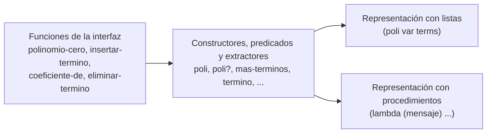

# Informe de corrección — Taller 1: polinomios dispersos

**Curso:** Fundamentos de Interpretación y Compilación de Lenguajes
de Programación — Universidad del Valle, Sede Tuluá.

**Integrantes del grupo:**

| Nombre | Código | Correo institucional |
|--------|--------|----------------------|
| Juan Felipe Aristizabal | 2459364-3743 | juan.felipe.aristizabal@correounivalle.edu.co |
| Juan Sebastian Huertas | 2459505-3743 | huertas.juan@correounivalle.edu.co |

---

## 1. Marco formal

### 1.1 Corrección de programas recursivos

Sea $f : A \to B$ una función y $A$ un conjunto definido
recursivamente. Sea $P_f$ un programa recursivo en Racket que pretende
calcular $f$. Decimos que $P_f$ es correcto con respecto a su
especificación si se cumple:

$$
\forall a \in A \,:\, P_f(a) = f(a)
$$

La estrategia de demostración es **inducción estructural** sobre $A$.
Aquí $A$ es el conjunto de listas de términos que genera la gramática:

- **Caso base:** $a = \text{sin-terminos}()$, y se verifica
  $P_f(a) = f(a)$ directamente.
- **Caso inductivo:** $a = \text{mas-terminos}(t, r)$. Se asume la
  **hipótesis de inducción** $P_f(r) = f(r)$ sobre el resto de la
  lista y se demuestra $P_f(a) = f(a)$.

Si alguna de sus funciones quedó escrita con un acumulador en lugar de
recursión estructural, la corrección se argumenta con una invariante
del acumulador y no con la hipótesis de inducción: enuncie la
invariante, demuestre que vale al inicio, que cada paso la conserva y
que al terminar implica la post-condición.

### 1.2 El invariante de la representación

Las cuatro condiciones del enunciado se enuncian como una única
propiedad sobre polinomios. Sea $p$ un polinomio con términos
$t_1, t_2, \ldots, t_n$, donde $t_i = (c_i, e_i)$:

$$
\mathrm{Inv}(p) \equiv
\underbrace{\forall i < n : e_i > e_{i+1}}_{\text{orden estricto}}
\ \land\
\underbrace{\forall i : c_i \neq 0}_{\text{sin ceros}}
\ \land\
\underbrace{\forall i : e_i \in \mathbb{N}}_{\text{exponentes naturales}}
\ \land\
\underbrace{\forall i : \mathrm{red}(c_i)}_{\text{racionales reducidos}}
$$

donde $\mathrm{red}\left(\frac{a}{b}\right)$ abrevia
$b > 0 \,\land\, \mathrm{mcd}(|a|, b) = 1$, y un coeficiente entero se
toma como el racional de denominador $1$.

En el código, la cuarta condición la garantiza la traducción de
números de Racket a coeficientes (`concreto->coeficiente`): un entero
se guarda como `coef-ent` (denominador $1$) y una fracción como
`coef-rac` con `numerator` y `denominator`, que en Racket siempre
devuelven el numerador y el denominador de la fracción **ya reducida**
y con denominador positivo. Las demás tres condiciones se verifican
caso por caso en las secciones siguientes.

Para hablar de lo que "dice" un polinomio sin mirar su forma, se usa la
función $f_p : \mathbb{N} \to \mathbb{Q}$ que da el coeficiente de
$x^e$ en $p$, o $0$ si $p$ no tiene término con ese exponente. Con
$\mathrm{Inv}(p)$ cada exponente aparece a lo sumo una vez, así que
$f_p$ está bien definida.

---

## 2. Funciones analizadas

### 2.1 Corrección de `coeficiente-de`

**Especificación.**

- **Tipo:** `coeficiente-de : polinomio × exponente -> coeficiente`
- **Pre-condición:** $\mathrm{Inv}(p)$ y $e \in \mathbb{N}$. Si $e$ no es
  un entero no negativo o si $p$ no es un polinomio, la función levanta
  `eopl:error` antes de recorrer nada.
- **Post-condición:** $\text{Post}(p, e, r) \equiv r = f_p(e)$ cuando
  el exponente $e$ aparece en $p$; y la función levanta
  `eopl:error` cuando no aparece.

**Código.**

```racket
; buscar-coeficiente : terminos x natural -> numero
; Recorre la lista una sola vez y corta apenas el exponente actual es menor que el buscado.
(define buscar-coeficiente
  (lambda (terminos exponente)
    (if (sin-terminos? terminos)
        (eopl:error 'coeficiente-de "El polinomio no tiene termino con ese exponente")
        (let* ((actual (mas-terminos->term terminos))
               (resto  (mas-terminos->resto terminos))
               (expo   (expo-nat->k (termino->expo actual))))
          (cond
            ((> expo exponente)
             (buscar-coeficiente resto exponente))
            ((= expo exponente)
             (coeficiente->concreto (termino->coef actual)))
            (else
             (eopl:error 'coeficiente-de "El polinomio no tiene termino con ese exponente")))))))

; coeficiente-de : polinomio x natural -> numero
; Devuelve el coeficiente del término con ese exponente. Da error si no existe.
(define coeficiente-de
  (lambda (polinomio exponente)
    (cond
      ((not (exponente-concreto? exponente))
       (eopl:error 'coeficiente-de "El exponente debe ser un entero no negativo"))
      ((not (poli? polinomio))
       (eopl:error 'coeficiente-de "El primer argumento debe ser un polinomio"))
      (else
       (buscar-coeficiente (poli->terms polinomio) exponente)))))
```

La recursión vive en `buscar-coeficiente`; `coeficiente-de` solo valida
y la llama con la lista de términos de $p$.

**Lema.** Sea $L$ una lista de términos con $\mathrm{Inv}(L)$ y
$e \in \mathbb{N}$. Si $e$ aparece en $L$, entonces
`buscar-coeficiente`$(L, e) = f_L(e)$; si no aparece, levanta
`eopl:error`.

**Demostración** por inducción estructural sobre $L$.

- **Caso base** ($L = \text{sin-terminos}()$): la lista no tiene
  términos, así que $e$ no aparece en ella. El programa entra por la
  rama `sin-terminos?` y levanta `eopl:error`. Eso es exactamente lo
  que pide la especificación cuando el exponente no está.

  $$
  \text{buscar-coeficiente}(\text{sin-terminos}(), e) = \text{error}
  \qquad \text{y} \qquad e \notin \text{sin-terminos}()
  $$

- **Caso inductivo** ($L = \text{mas-terminos}(t, r)$ con
  $t = (c', k)$): de $\mathrm{Inv}(L)$ salen tres hechos: $c' \neq 0$,
  $k > e_j$ para todo exponente $e_j$ de $r$ (el orden es estricto y
  $t$ va primero) y $\mathrm{Inv}(r)$, porque un sufijo conserva las
  cuatro propiedades. Hay tres comparaciones entre $k$ y $e$:

  - **$k > e$ (paso recursivo).** El programa llama
    `buscar-coeficiente`$(r, e)$. Como $k \neq e$, el término $t$ no es
    el buscado, así que $e$ aparece en $L$ si y solo si aparece en $r$,
    y $f_L(e) = f_r(e)$. Por **hipótesis de inducción** sobre $r$, la
    llamada devuelve $f_r(e) = f_L(e)$ si $e$ aparece en $r$, y levanta
    error si no aparece.

  - **$k = e$.** El término buscado es $t$. El programa devuelve
    $c'$ convertido con `coeficiente->concreto`, es decir
    $f_L(e) = c'$. No hay llamada recursiva.

  - **$k < e$ (corte).** Por el orden estricto, todos los exponentes
    de $L$ son menores o iguales que $k$: $k$ es el mayor (va primero)
    y los de $r$ son todavía menores. Entonces todos son menores que
    $e$ y $e$ **no** aparece en $L$. Por eso el programa puede
    levantar el error sin mirar $r$: seguir buscando es inútil. Sin el
    orden estricto del invariante este corte sería incorrecto, porque
    el exponente buscado podría estar más adelante.

  $$
  \text{buscar-coeficiente}(t :: r, e) =
  \begin{cases}
    \text{buscar-coeficiente}(r, e) & \text{si } k > e \\
    c' & \text{si } k = e \\
    \text{error} & \text{si } k < e
  \end{cases}
  $$

- **Levantamiento del error.** El error sale de dos lugares: la rama
  base (lista vacía) y la rama $k < e$. En ambos $e$ no aparece en la
  lista actual, y por hipótesis de inducción un error que llega desde
  la llamada sobre $r$ (caso $k > e$) significa que $e$ no aparece en
  $r$, y por tanto tampoco en $L$. Así, si hay error entonces $e$ no
  está. Recíprocamente, si $e$ aparece en $L$ nunca se llega a una rama
  de error: en la base es imposible, $k < e$ es imposible porque
  implicaría que $e$ no aparece, y en $k > e$ se aplica la hipótesis
  de inducción sobre $r$, que contiene a $e$. Luego el error se
  levanta cuando el exponente no está y **solo** en ese caso. Los
  errores de validación (`exponente` no natural, argumento que no es
  polinomio) se levantan antes, en `coeficiente-de`, y no entran en
  esta demostración porque violan la pre-condición.

- **Terminación.** La medida es $n$, el número de términos de $L$. La
  única llamada recursiva ocurre en el caso $k > e$ y se hace sobre
  $r$, que tiene $n - 1$ términos: la medida decrece estrictamente en
  cada llamada. Cuando $n = 0$ (`sin-terminos`) no hay llamada, así que
  la cota inferior es $0$ y la recursión termina. En total hay a lo
  sumo $n + 1$ invocaciones: la lista se recorre una sola vez.

**Conclusión:** para cualquier $p$ con $\mathrm{Inv}(p)$ y entradas
válidas, `coeficiente-de` devuelve $f_p(e)$ cuando el exponente $e$
aparece en $p$ y levanta `eopl:error` cuando no aparece, recorriendo la
lista como máximo una vez y cortando apenas el exponente actual es
menor que el buscado.

---

### 2.2 Corrección de `eliminar-termino`

**Especificación.**

- **Tipo:** `eliminar-termino : polinomio × exponente -> polinomio`
- **Pre-condición:** $\mathrm{Inv}(p)$ y $e \in \mathbb{N}$. Si $e$ no
  es un entero no negativo o si $p$ no es un polinomio, la función
  levanta `eopl:error` antes de construir nada.
- **Post-condición:** el resultado contiene **exactamente** los
  términos de $p$ menos el de exponente $e$. Formalmente:
  $$
  \text{terminos}(r) = \text{terminos}(p) \setminus \{(f_p(e),\, e)\}
  $$
  con la misma variable que $p$ y $\mathrm{Inv}(r)$, y la función
  levanta `eopl:error` si $e$ no aparece en $p$.

**Código.**

```racket
; eliminar-de-terminos : terminos x natural -> terminos
; Recorre la lista una sola vez y corta apenas el exponente actual es menor que el buscado.
(define eliminar-de-terminos
  (lambda (terminos exponente)
    (if (sin-terminos? terminos)
        (eopl:error 'eliminar-termino "El polinomio no tiene termino con ese exponente")
        (let* ((actual (mas-terminos->term terminos))
               (resto  (mas-terminos->resto terminos))
               (expo   (expo-nat->k (termino->expo actual))))
          (cond
            ((> expo exponente)
             (mas-terminos actual (eliminar-de-terminos resto exponente)))
            ((= expo exponente)
             resto)
            (else
             (eopl:error 'eliminar-termino "El polinomio no tiene termino con ese exponente")))))))

; eliminar-termino : polinomio x natural -> polinomio
; Devuelve el polinomio sin el término con ese exponente. Da error si no existe.
(define eliminar-termino
  (lambda (polinomio exponente)
    (cond
      ((not (exponente-concreto? exponente))
       (eopl:error 'eliminar-termino "El exponente debe ser un entero no negativo"))
      ((not (poli? polinomio))
       (eopl:error 'eliminar-termino "El primer argumento debe ser un polinomio"))
      (else
       (poli (poli->var polinomio)
             (eliminar-de-terminos (poli->terms polinomio) exponente))))))
```

**Lema.** Sea $L$ una lista de términos con $\mathrm{Inv}(L)$ y
$e \in \mathbb{N}$. Si $e$ aparece en $L$, entonces
$R = $ `eliminar-de-terminos`$(L, e)$ cumple $\mathrm{Inv}(R)$ y
$\text{terminos}(R) = \text{terminos}(L) \setminus \{(f_L(e), e)\}$,
con los términos restantes en el mismo orden. Si $e$ no aparece,
levanta `eopl:error`.

**Demostración** por inducción estructural sobre $L$.

- **Caso base** ($L = \text{sin-terminos}()$): no hay términos, $e$ no
  aparece y el programa levanta `eopl:error`, como pide la
  especificación.

- **Caso inductivo** ($L = \text{mas-terminos}(t, r)$ con
  $t = (c', k)$): de $\mathrm{Inv}(L)$ salen $c' \neq 0$, $k > e_j$
  para todo exponente $e_j$ de $r$ y $\mathrm{Inv}(r)$. Tres subcasos:

  - **$k > e$ (paso recursivo).** El resultado es $R = t :: R'$ con
    $R' = $ `eliminar-de-terminos`$(r, e)$. Como $k \neq e$, $e$ aparece
    en $L$ si y solo si aparece en $r$. Por **hipótesis de inducción**,
    $R'$ cumple $\mathrm{Inv}(R')$ y
    $\text{terminos}(R') = \text{terminos}(r) \setminus \{(f_r(e), e)\}$
    (o hay error si $e \notin r$). Entonces
    $\text{terminos}(R) = \{t\} \cup \text{terminos}(R')
    = \text{terminos}(L) \setminus \{(f_L(e), e)\}$, porque $t$ no es
    el término de exponente $e$. Para $\mathrm{Inv}(R)$: $t$ no cambió,
    así que sigue sin cero, con exponente natural y coeficiente
    reducido; los exponentes de $R'$ son un subconjunto de los de $r$,
    todos menores que $k$, así que $t$ puede ir delante de $R'$ sin
    romper el orden estricto; lo demás viene de $\mathrm{Inv}(R')$.

  - **$k = e$.** El resultado es $R = r$. Los términos de $R$ son los
    de $L$ menos $t = (c', e)$, que es el término de exponente $e$, y
    en el mismo orden. $\mathrm{Inv}(R) = \mathrm{Inv}(r)$ vale porque
    un sufijo de una lista con $\mathrm{Inv}$ conserva el orden
    estricto de los términos que quedan, y como solo se quita un
    término no se crea ningún coeficiente cero. No hay llamada
    recursiva.

  - **$k < e$ (corte).** Igual que en 2.1, por el orden estricto
    todos los exponentes de $L$ son menores que $e$, así que $e$ no
    aparece y se levanta el error sin recorrer $r$.

  $$
  \text{eliminar-de-terminos}(t :: r, e) =
  \begin{cases}
    t :: \text{eliminar-de-terminos}(r, e) & \text{si } k > e \\
    r & \text{si } k = e \\
    \text{error} & \text{si } k < e
  \end{cases}
  $$

- **Levantamiento del error.** Igual que en 2.1: el error solo sale de
  la rama base y de la rama $k < e$, y en ambas $e$ no aparece. El
  error que llega desde la llamada sobre $r$ (caso $k > e$) significa,
  por hipótesis de inducción, que $e \notin r$, y por tanto
  $e \notin L$. Si $e$ aparece, nunca se llega a una rama de error.

- **Terminación.** La medida es $n$, el número de términos de $L$. La
  única llamada recursiva (caso $k > e$) se hace sobre $r$, con
  $n - 1$ términos, así que decrece estrictamente. Con $n = 0$ no hay
  llamada: la cota inferior es $0$ y la recursión termina, con a lo
  sumo $n + 1$ invocaciones.

- **El resultado sigue cumpliendo $\mathrm{Inv}$.** `eliminar-termino`
  arma `poli(var, eliminar-de-terminos(L, e))` con la misma variable de
  $p$. Quitar un término no rompe el orden estricto (los que quedan
  conservan su orden relativo y siguen siendo estrictamente
  decrecientes) ni introduce ceros (no se crea ningún coeficiente
  nuevo), y los exponentes naturales y coeficientes reducidos son los
  de los términos originales. Por tanto $\mathrm{Inv}(r)$.

**Conclusión:** para cualquier $p$ con $\mathrm{Inv}(p)$ y entradas
válidas, `eliminar-termino` devuelve un polinomio con la misma
variable, que cumple $\mathrm{Inv}$ y cuyos términos son exactamente
los de $p$ menos el de exponente $e$; si $e$ no aparece, levanta
`eopl:error`.

---

## 3. Equivalencia de las dos representaciones

Las funciones de la interfaz (`polinomio-cero`, `insertar-termino`,
`coeficiente-de`, `eliminar-termino`) están escritas **una sola vez**, y
el mismo texto sirve para las dos representaciones. El bloque entre
`;; ---- Interfaz: inicio` y `;; ---- Interfaz: fin ----` es idéntico
línea por línea en `polinomios-listas.rkt` y
`polinomios-procedimientos.rkt`; esto se comprueba con `diff` y la
salida es vacía. Lo que cambia entre los dos archivos (además del encabezado) es la
sección de constructores, predicados y extractores. Esta es la idea de
la sección 2.2 de EOPL: el cliente solo habla con la interfaz y la
representación queda del lado de adentro.



- **Qué ve el cliente de un polinomio.** Tiene a su disposición
  constructores (`poli`, `mas-terminos`, `termino`, `coef-ent`, ...),
  predicados (`poli?`, `sin-terminos?`, ...) y extractores
  (`poli->var`, `poli->terms`, `mas-terminos->term`, ...). Todo lo que
  se puede saber de un dato está en las ecuaciones que relacionan esas
  operaciones, por ejemplo:

  $$
  \texttt{poli->var}(\texttt{poli}(v, ts)) = v \qquad
  \texttt{poli->terms}(\texttt{poli}(v, ts)) = ts \qquad
  \texttt{poli?}(\texttt{poli}(v, ts)) = \text{verdadero}
  $$

  y las análogas para las otras variantes. Lo que **no** puede hacer es
  tratar el dato como lista (`car`, `cadr`), como procedimiento
  (aplicarlo a un mensaje) ni preguntar cómo está hecho.

- **Qué cambia entre las dos representaciones y por qué queda adentro.**
  Con listas, `poli` arma `(list 'poli var terms)` y el extractor toma
  el segundo o tercer elemento con `cadr` y `caddr`. Con procedimientos,
  `poli` devuelve un procedimiento que recibe un mensaje (`'etiqueta`,
  `'var`, `'terms`) y responde, y el extractor le pide el campo con
  `(dato 'var)`. Aunque la forma interna difiere, las dos cumplen las
  mismas ecuaciones. Como las funciones de la interfaz están definidas
  solo mediante esas operaciones, cada una calcula exactamente lo mismo
  en ambas: reemplazar una representación por la otra no cambia ningún
  resultado observable. Por eso las pruebas de la Parte 4 comparan los
  polinomios mediante `polinomio->pares`, que es un observador hecho
  con los extractores, y no por su estructura interna.

- **Qué habría que hacer para que el cliente notara la diferencia.**
  Bastaría que algún código usara la forma interna en vez de la
  interfaz. Por ejemplo, `(cadr p)` funciona con la representación de
  listas y falla con un error de contrato con la de procedimientos;
  `(p 'var)` ocurre al revés. También `equal?`: dos polinomios
  construidos por separado con los mismos términos son `equal?` con
  listas, pero con procedimientos no, porque dos procedimientos distintos
  nunca son `equal?`. Si algo así apareciera en el cliente, el resultado
  dependería de la representación, y eso significaría que la abstracción
  se rompió: la interfaz habría dejado de ocultar la representación.

---

## 4. Referencias

- Friedman, D. P., & Wand, M. *Essentials of Programming Languages*,
  3.ª ed., MIT Press, 2008. Sección 2.1 (especificación de datos),
  sección 2.2 (representación basada en listas y basada en
  procedimientos), sección 2.4 (`define-datatype` y `cases`).
- Enunciado del Taller 1 de FLP 2026-2, Universidad del Valle, Sede Tuluá.
